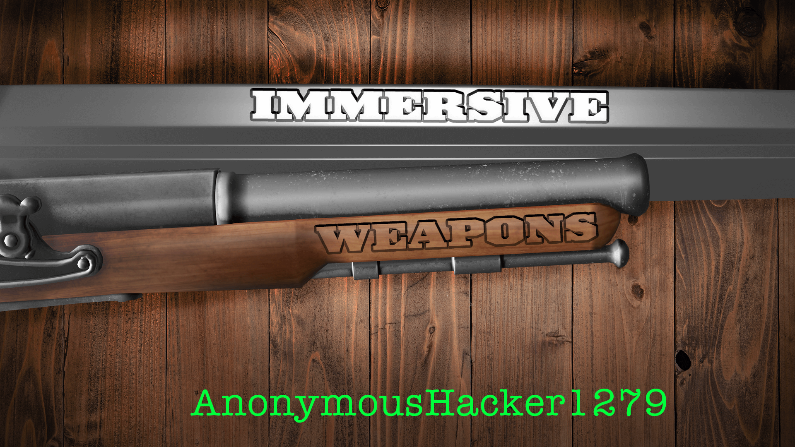

# Immersive Weapons for Minecraft

## A weapons mod for Minecraft

Immersive Weapons is <s>a weapons mod</s> more than just a weapons mod aiming to spice up your combat skills.

Traverse the world, scavenging in destroyed factories or climbing to the pits of hell to collect new and powerful
resources. Build stronger and more versatile weapons of war. Fortify your base and sound alarms at the first sign of
intrusion by invaders.

A few things that will be the highlight of your experience:

- Tiered Pikes, so you can stab someone from way over there
- Flintlock Pistol, Blunderbuss, and Musket, so you can shoot someone from way over there
- New and Powerful Swords, so you can slice someone that isn't way over there
- Tiered Gauntlets, so you can punch someone that isn't way over there, but not over there enough to use a sword
- Medical Equipment, so you can survive getting stabbed, shot, and sliced
- Environmental Traps, so you can stop people from coming over to stab, shoot, and slice you
- Accessories, to improve your ability to stab, shoot, and slice people (or to improve your ability to not get stabbed,
  shot, and sliced)

A few other notes:

- I only intend to work on the latest versions of Minecraft. Please don't ask about porting to old versions.
- This is for the NeoForge modloading platform. I have no plans to port to other modloaders.
- Yes, you can include it in modpacks, provided it is open source and doesn't have an installer.
- This is open source. If you want to port to old versions or to another loader, that's fine, but I cannot help with
  that.
- This is NOT to be reposted to any mod reposting websites. The only places you should download this mod are the
  CurseForge page, the Modrinth page, or this GitHub repository. #StopModReposts

[Interested in the development of this project, or just want to hang out? Join the Official Discord server](https://discord.gg/WNMCTg7TsT)

## Version Support

Active development will be focused on the latest Minecraft version. You should upgrade to newer versions of Immersive
Weapons for bug fixes and new features.

When looking at the mod file, the version looks like
this: `ImmersiveWeapons-<Minecraft version>-<Immersive Weapons version>`. For example, `ImmersiveWeapons-1.18.2-1.15.0`.
The Minecraft version is simple: it only changes when the mod is updated to newer versions of Minecraft.

The Immersive Weapons version is a bit more complex:  
When the first number changes (**1**.15.0), it is a major change. For example, changing from an in-dev to a full
release. This probably won't ever change.  
When the second number changes (1.**15**.0), it is a minor change. For example, adding new features, improvements, etc.
These are usually content releases or large rewrites.  
When the third number changes (1.15.**0**), it is a bugfix/patch. These are small changes that correct behaviors or
otherwise add small functionalities.

You should always update to the latest bugfix/patch version. Updating to the latest minor version is also recommended,
but can be treated with a lower priority. Read the update changelogs associated with new releases for any important
information about that release.

This table lists the latest Immersive Weapons version for a Minecraft version. If anything is listed other than
**Latest**, consider it to be at the End of Life. In some cases, an older version will receive bugfixes should the
community describe an interest in it (This excludes versions listed as **N/A - Build From Source**).

| MC Version | Immersive Weapons Latest Version                                                                             |
|------------|--------------------------------------------------------------------------------------------------------------|
| 1.20.4     | [Latest](https://github.com/AnonymousHacker1279/ImmersiveWeapons/releases)                                   |
| 1.20.2     | [1.28.0](https://github.com/AnonymousHacker1279/ImmersiveWeapons/releases/tag/v1.28.0)                       |
| 1.20.1     | [1.27.6](https://github.com/AnonymousHacker1279/ImmersiveWeapons/releases/tag/v1.27.6)                       |
| 1.19.4     | [1.23.2](https://github.com/AnonymousHacker1279/ImmersiveWeapons/releases/tag/v1.23.2)                       |
| 1.19.3     | [1.21.0](https://github.com/AnonymousHacker1279/ImmersiveWeapons/releases/tag/v1.21.0)                       |
| 1.19.2     | [N/A - Build From Source](https://github.com/AnonymousHacker1279/ImmersiveWeapons/tree/1.19.2-dev)           |
| 1.19       | [1.18.4](https://github.com/AnonymousHacker1279/ImmersiveWeapons/releases/tag/1.18.4)                        |
| 1.18.2     | [1.17.4](https://github.com/AnonymousHacker1279/ImmersiveWeapons/releases/tag/v1.17.4)                       |
| 1.18.1     | [(ALPHA) 1.14.0-alpha1](https://github.com/AnonymousHacker1279/ImmersiveWeapons/releases/tag/v1.14.0-alpha1) |
| 1.17.1     | [1.12.1](https://github.com/AnonymousHacker1279/ImmersiveWeapons/releases/tag/v1.12.1)                       |
| 1.16.5     | [1.4.3](https://github.com/AnonymousHacker1279/ImmersiveWeapons/releases/tag/v1.4.3)                         |
| 1.16.4     | [1.1.1](https://github.com/AnonymousHacker1279/ImmersiveWeapons/releases/tag/v1.1.1)                         |
| 1.15.2     | [N/A - Build From Source](https://github.com/AnonymousHacker1279/ImmersiveWeapons/tree/1.15.2-dev)           |

### NeoForge vs Forge

Immersive Weapons versions including and prior to v1.24.x were designed for the classic Forge modloader. However, as of
v1.25.0, Immersive Weapons is now designed for the NeoForge modloader. The reason for this can be found on the Neoforged
[project blog](https://neoforged.net/news/theproject/). It is expected that a majority of the existing Forge community
will migrate to NeoForge.

On MC 1.20.1, NeoForge should be compatible with Forge mods, so IW v1.25.x-v1.27.x should also work on both. However, if
you experience issues on Forge, try NeoForge. Starting at MC 1.20.2 there is a hard break on compatibility between the
two modloaders. I will not (and cannot feasibly) maintain two separate versions of Immersive Weapons for Forge and
NeoForge.

## Contributing

See [CONTRIBUTING.md](https://github.com/AnonymousHacker1279/ImmersiveWeapons/blob/master/CONTRIBUTING.md).

## Bug Reports and Feature Suggestions

Bug reports and feature suggestions are welcomed. However, there are a few things you need to include when making them.

- **Title**. You need to have a title that accurately summarizes the rest of the report.
- **Description**. You need to describe EXACTLY what happens/should happen. Also list steps you can take to reproduce
  this.
- **Additional Context**. List any other information that is important in understanding your report.

Specifically for bug reports:

- **Version Information**. You need to list the Minecraft version you are using, the Immersive Weapons version, and the
  NeoForge version.
- **Debug logs**. You MUST upload your debug log. Otherwise, I won't be able to determine what isn't working. The bug
  report template lists where to find them at.

**Providing the requested information at the beginning can make the difference between a three-hour update and a
three-day update.**

Before making a report, update to the latest version of Immersive Weapons and NeoForge. It's possible that what you're
looking for was merged into a newer release.

## License

Immersive Weapons is [MIT licensed](https://github.com/AnonymousHacker1279/ImmersiveWeapons/blob/master/LICENSE),
excluding its assets, which
are [CC-BY-NC-SA licensed](https://github.com/AnonymousHacker1279/ImmersiveWeapons/blob/master/src/main/resources/assets/immersiveweapons/LICENSE).

## Translations

Some translations (`es_es` and `ru_ru`) were generated automatically using
my (now decrepit) [Mr. Worldwide](https://github.com/AnonymousHacker1279/MrWorldwide) toolkit. They are probably not too
accurate, and I don't have the time to fix them. I have not generated any other translations in a long time as the
toolkit proved to be too unreliable.

If you want to clean up the translations then please go ahead and make a contribution. I appreciate it.